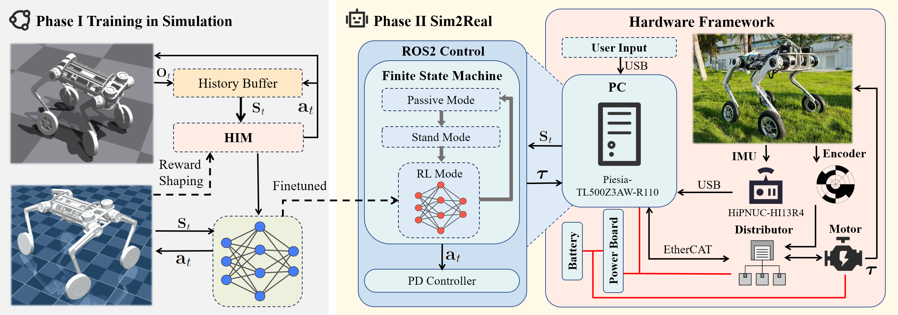
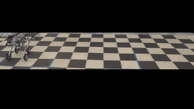
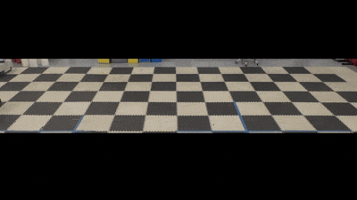
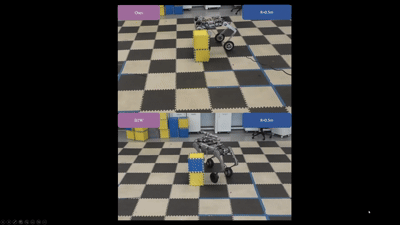
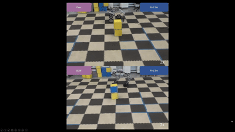
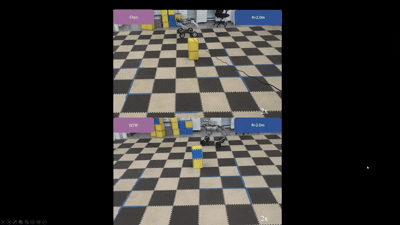

# FLORES: A Reconfigured Wheel-Legged Robot for Enhanced Steering and Adaptability

Overview of mechanical design: (a) Illustration of the joint DoF design for FLORES, along with the positioning of electrical components. The magnified view on the lower side shows the joint layout of the front left leg. (b) Range of motion for the front hip joint. (c) Range of motion for the rear hip joint.

Overview of our system architecture and training pipeline. The training process consists of two phases: Phase I involves sim-to-sim transfer, where the HIM policy is first trained in Isaac Gym with reward shaping, and then is transferred and validated in MuJoCo as an intermediate step; Phase II performs Sim2Real deployment using ROS2 control framework to establish robot communications. The hardware framework (right panel) shows the onboard PC receiving user input and combining it with current observations to feed into the trained RL model, which outputs actions for robot control. Red lines indicate power connections, and black arrows show the information flow.

## Results

### FLORES Navigating on Various Terrains

### FLORES and B2W Perform Lateral Walking

### FLORES and B2W Perform Stright-line Motion

command speed = 0.5 m/s

command speed = 1.0 m/s

command speed = 1.5 m/s

### FLORES and B2W Perform Turning Maneuver
radius = 0.5m

radius = 1.0m

radius = 1.5m

radius = 2.0m

### FLORES and B2W Perform Path Tracking

## Mechanical parts
All machined parts are manufactured with outsourced CNC service. The .stl file of all the parts can be found in Mechanical floder.

## Authors

